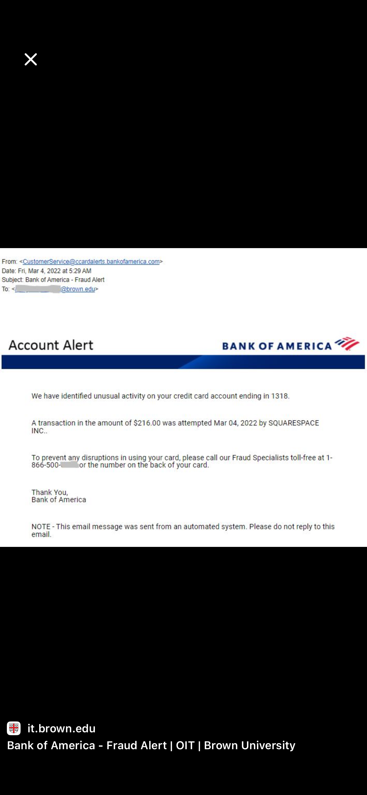
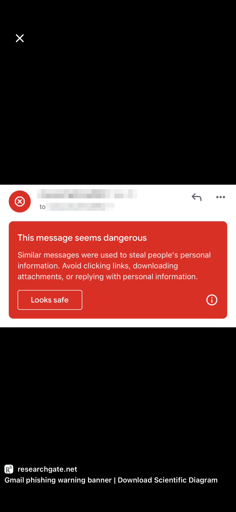
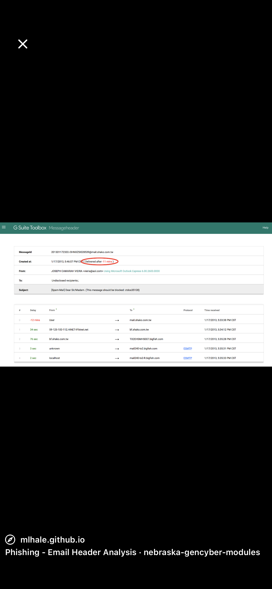
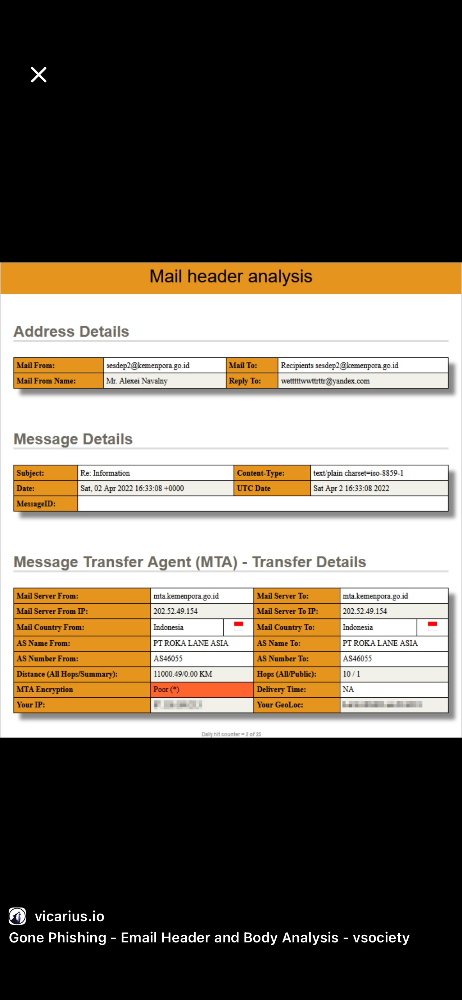

# Phishing Email Analysis

## 📌 Objective
To identify phishing emails using header and content analysis.

## 🔍 Analysis
- Checked sender email address
- Verified suspicious links
- Analyzed email headers

## 🚨 Indicators of Phishing
- Fake domain name
- Urgent message tone
- Suspicious links

## 📷 Screenshots

## 📚 Conclusion
This project demonstrates phishing detection skills useful for SOC analysts.

## 🧠 Skills Demonstrated
- Email analysis
- Phishing detection
- Threat identification
- Incident response basics
